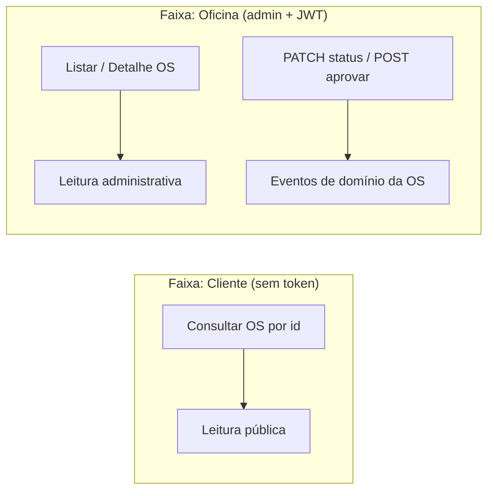
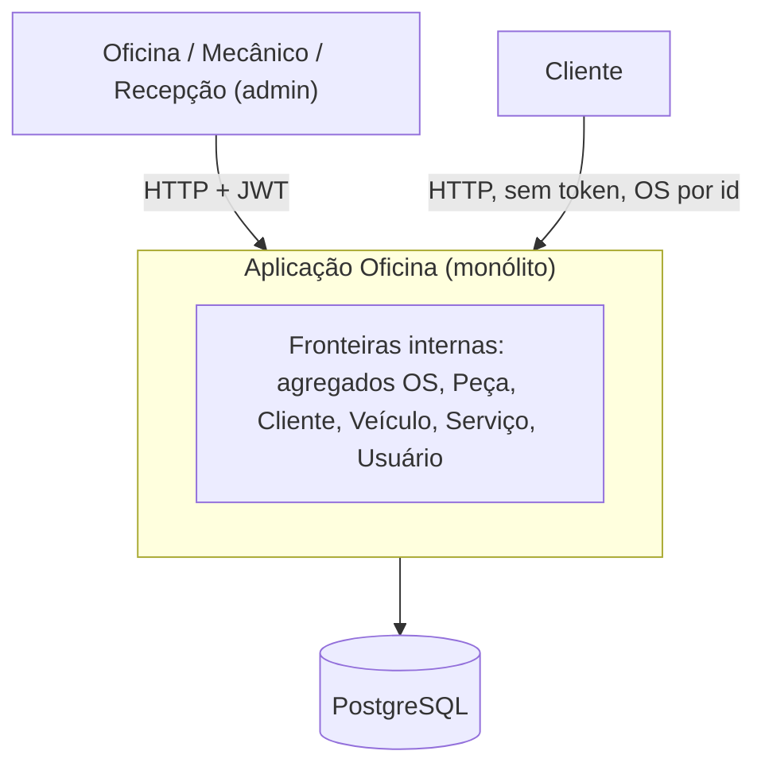
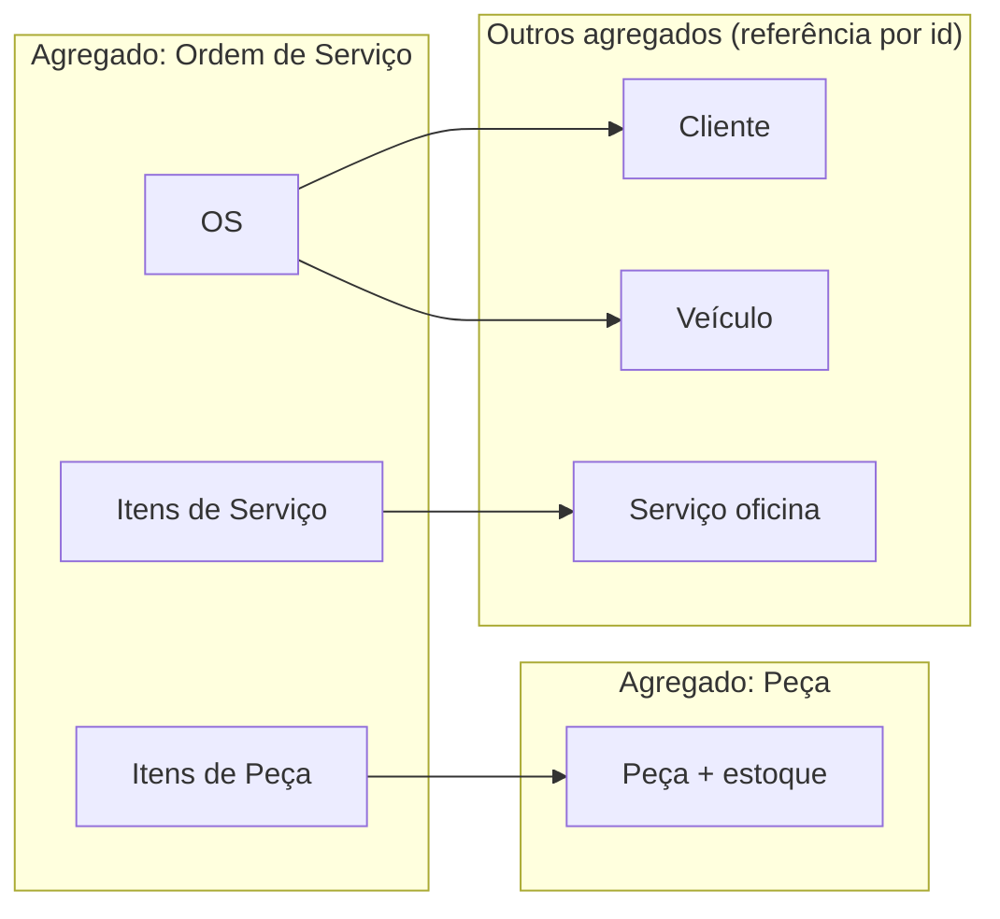
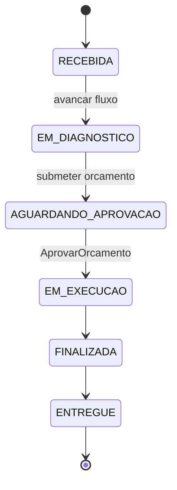
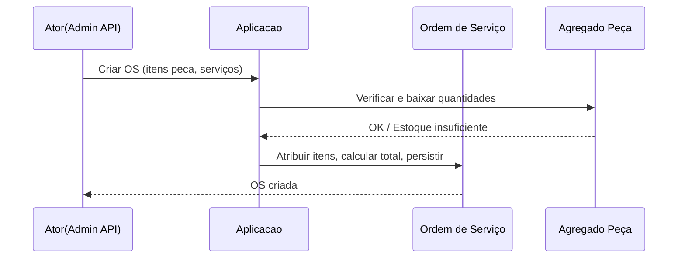
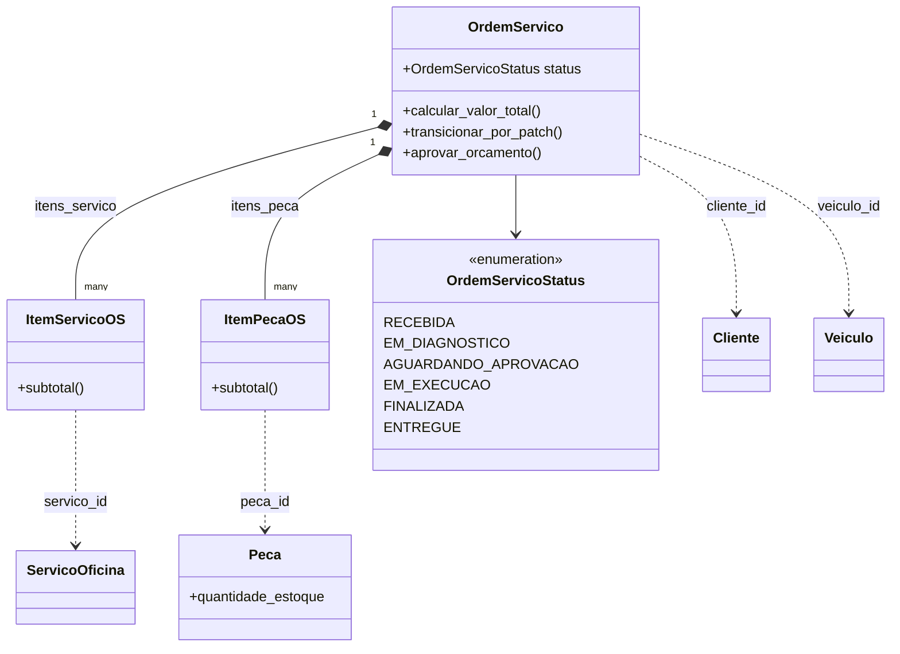
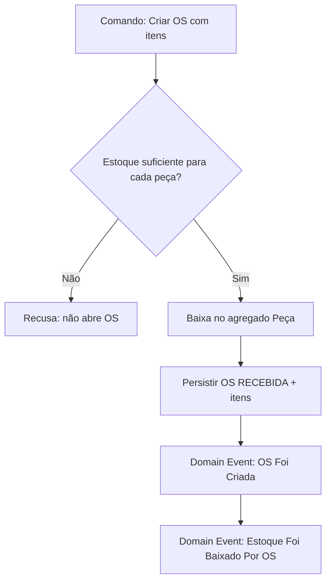
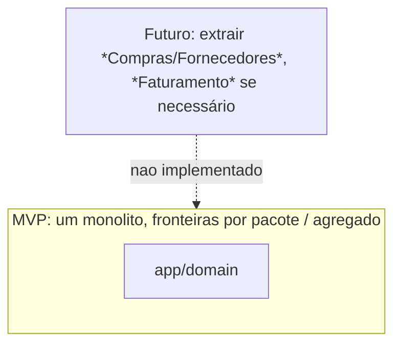

# Documentação DDD — Oficina Mecânica

**Propósito:** apoiar modelagem e discussão de domínio (Miro, FigJam, ou ferramenta equivalente), alinhada ao **Event Storming** (Brandolini) e aos blocos clássicos de **DDD** (Linguagem Ubíqua, Agregados, Contexto Delimitado).

**Como usar no Miro:** crie *frames* (áreas) por seção, use **notas** coloridas conforme a legenda abaixo e ligue com **setas** (fluxo temporal da esquerda para a direita, ou de cima para baixo). Os diagramas **Mermaid** podem ser colados em [Mermaid Live](https://mermaid.live), exportados como **SVG/PNG** e inseridos no Miro, ou replicados manualmente com *shapes*.

---

## 1. Legenda Event Storming (padrão comum de cores)

> Ajuste os nomes das cores ao template do Miro, mantendo a **legenda** visível no quadro.

| Cor / tipo | Nome no workshop | O que colocar |
|------------|-------------------|---------------|
| Laranja | **Domain Event** | Algo **já aconteceu** no passado, verbo no passado (p.ex. *OS Criada*). |
| Azul claro | **Comando** | Intenção / pedido: “*Abrir* OS” — o que alguém ou sistema **quer** que ocorra. |
| Amarelo claro (pequeno) | **Ator** | *Recepcionista*, *Mecânico*, *Sistema de OS*, *Cliente*… |
| Amarelo (grande) | **Agregado / regra** | *Ordem de Serviço* — onde invariantes e consistência vivem. |
| Rosa | **Sistema externo** | (Opcional) Gateway de pagamento, e-mail, etc. *— MVP mínimo.* |
| Lilás | **Política** | *Quando* X, *então* Y (regra reativa, não só CRUD). |
| Verde claro | **Modelo de leitura** | Tela, relatório, *query* otimizada — o que o usuário **lê** (não a fonte da verdade de escrita). |
| Vermelho | *Hot spot* (opcional) | Ponto de tensão, dúvida, risco — “precisamos decidir…” |

---

## 2. Linguagem ubíqua

*Termos acordados entre negócio e time técnico; o código e a API usam o mesmo vocabulário sempre que possível.*

| Termo (PT) | Definição | Termo no código (quando houver) |
|------------|------------|----------------------------------|
| **Ordem de Serviço (OS)** | Unidade de trabalho que liga **Cliente**, **Veículo** e a lista de **Serviços** e **Itens de Peça**; tem **status** e **valor total** calculado. | `OrdemServico` |
| **Cliente** | Pessoa ou empresa (CPF/CNPJ) com **contato** para comunicação. | `Cliente` |
| **Veículo** | Meio (placa, marca, modelo, ano) vinculado a **um** Cliente. | `Veiculo` |
| **Serviço (de oficina)** | Trabalho catalogado (nome, preço) reutilizável em várias OS. | `ServicoOficina` |
| **Peça** | Insumo revendido ou aplicado na OS, com **preço** e **quantidade em estoque**. | `Peca` |
| **Item de serviço na OS** | Linha: qual **serviço** da tabela, quantas **unidades**, com **preço de referência** (snapshot) naquela data. | `ItemServicoOS` |
| **Item de peça na OS** | Linha: qual **peça**, **quantidade**, com **preço de referência**; dispara **baixa de estoque**. | `ItemPecaOS` |
| **Orçamento** | Soma dos itens; formalizado antes da execução, implícito em **Aprovar**. | (conceito de processo) |
| **Aprovar orçamento** | Decisão do cliente/negócio: OS passa a poder **entrar em execução** (não substituível por um simples PATCH de status a partir de *aguardando aprovação*). | *aprovar* / `POST /os/{id}/aprovar` |
| **Estoque** | Quantidade disponível da peça; **não** pode ficar **negativa**. | `quantidade_estoque` + regra no domínio |
| **Baixa de estoque** | Reserva / dedução ao vincular peças a uma **nova** OS (MVP: na criação da OS). | `reservar_ou_baixar` |
| **Ajuste de estoque** (admin) | Contagem, correção, entrada: alterar total ou somar *delta* conforme política do sistema. | `PecaEstoqueIn.ajuste_absoluto` |
| **Máquina de estados da OS** | Sequência válida: RECEBIDA → EM_DIAGNOSTICO → AGUARDANDO_APROVACAO → (aprovação) → EM_EXECUCAO → FINALIZADA → ENTREGUE. | `OrdemServicoStatus` + política |
| **Consulta pública da OS** | Acompanhamento de status e totais **sem** login, por identificador da OS (MVP: risco de enumeração — consciência de produto). | *OrdemPública* / DTO enxuto |

*Evitar jargão ambíguo fora do domínio, p.ex. usar “OS” e não “chamado genérico” se o negócio fala em OS.*

---

## 3. Event Storming — fluxo: Criação e acompanhamento da OS

### 3.1 Núcleo do agregado e invariantes (quadro amarelo grande, referência)

- **Agregado: Ordem de Serviço**  
  - *Invariantes:* valor total = soma dos itens; status só muda por transições permitidas; **execução** exige **aprovação** prévia; datas de finalização/entrega coerentes com o status.

### 3.2 Linha do tempo (esquerda → direita) — *Domain Events* (laranja)

> Cada nota: verbo + substantivo, **passado** — “o que aconteceu”.

1. **OS Foi Criada** (cliente e veículo vinculados, itens iniciais)  
2. **Diagnóstico Foi Iniciado** (ou *OS Foi Colocada Em Diagnóstico*)  
3. **Orçamento Foi Submetido Para Aprovação** (*OS Aguarda Aprovação*)  
4. **Orçamento Foi Aprovado** → em seguida o status permite execução  
5. **Serviço Foi Iniciado Em Execução** (*OS Em Execução*)  
6. **Serviço Foi Concluído** (*OS Finalizada*)  
7. **Veículo Foi Entregue ao Cliente** (*OS Entregue*)

### 3.3 Comandos (azul) — o que gera o evento

| Comando (intenção) | Dispara (evento principal) | Ator |
|--------------------|----------------------------|------|
| *Abrir OS* / *Registrar OS* | OS Foi Criada | Recepcionista / Sistema |
| *Iniciar diagnóstico* | ... Em Diagnóstico / Diagnóstico Iniciado | Mecânico / Oficina |
| *Solicitar aprovação do orçamento* | Orçamento Foi Submetido… | Sistema / Oficina |
| *Aprovar orçamento* (explícito) | Orçamento Foi Aprovado | Cliente (canal) / Regra de negócio |
| *Iniciar execução dos serviços* (após aprovar) | OS Em Execução (implícito no processo) | Mecânico |
| *Concluir serviços* | OS Finalizada | Mecânico / Oficina |
| *Registrar entrega* | Veículo Foi Entregue | Recepcionista |

*No MVP, “Aprovar orçamento” é um **comando** distinto; não basta “mudar status” de forma genérica a partir de AGUARDANDO APROVAÇÃO.*

### 3.4 Políticas (lilás)

- **Política:** *Quando* “Orçamento Aprovado”, *então* a OS **pode** transicionar para *Em Execução* (e não por PATCH genérico a partir de *aguardando*).  
- **Política:** *Quando* “OS Criada” com itens de peça, *então* executar **baixa de estoque** respeitando quantidade mínima zero.  
- **Política:** *Quando* muda o status para *Finalizada* / *Entregue*, *então* registrar a **data** correspondente (se aplicável ao modelo).

### 3.5 Modelos de leitura (verde)

- **Tela** lista de OS (fila de trabalho, filtros por status).  
- **Tela** detalhe da OS (itens, totais, status, datas).  
- **Consulta pública** (totais, status, datas mínimas — *sem* dados internos de custo, se a política evoluir).  

### 3.6 Event Storming — Acompanhamento (Cliente × Oficina)

*Quadro separado no Miro com **swimlanes** (faixas horizontais): uma para quem **não** tem login e outra para **administrador** autenticado.*

| Faixa | Ator | Comandos (azul) | Modelos de leitura (verde) | Domain events (laranja) |
|-------|------|-----------------|---------------------------|-------------------------|
| **Pública** | Cliente | *Consultar andamento da OS* (por identificador) | Resposta enxuta: status, totais, datas relevantes | *(derivado)* OS **é visualizada** no canal público |
| **Administrativa** | Recepção / Mecânico (JWT) | *Listar OS*, *Ver detalhe*, *Alterar status* (com máquina de estados), *Aprovar orçamento* | Lista, detalhe completo, formulários de mudança de status | Os mesmos da secção 3.2 conforme cada comando |

**Política (lilás):** *Consulta pública* não expõe dados internos administrativos; apenas o necessário para **acompanhamento** — alinhado ao DTO público na API.

---

## 4. Event Storming — fluxo: Gestão de peças e insumos

*Insumos = **Peças** (catálogo + estoque); *Serviços* são mão de obra/hora catalogada — fluxo de OS usa serviço sem estoque; peças sim.*

### 4.1 Agregado

- **Peça** (agregado): *nome, preço de referência, quantidade em estoque*; invariante: **estoque ≥ 0**.

### 4.2 Domain events (laranja) — possíveis na gestão (catálogo + depósito)

1. **Peça Foi Cadastrada**  
2. **Dados da Peça Foram Atualizados** (nome, preço)  
3. **Estoque Foi Ajustado** (recontagem, entrada, saída administrativa)  
4. **Estoque Foi Baixado Por OS** (múltiplas unidades) — reativo à OS, ou *evento de integração* vindo do agregado OS.  
5. (Futuro) **Estoque Foi Reposto Por Compra** — fora do MVP puro, mas anotável como *hot spot* (vermelho).

### 4.3 Comandos (azul)

| Comando | Efeito |
|--------|--------|
| *Cadastrar peça* | Peça Foi Cadastrada |
| *Atualizar cadastro da peça* | Dados Foram Atualizados |
| *Ajustar estoque* (absoluto ou *delta* conforme regra) | Estoque Foi Ajustado |
| (Integração) *Reservar/Baixar itens de peça da OS* | Estoque Foi Baixado Por OS |

### 4.4 Políticas (lilás) cruzando contextos

- *Quando* itens de peça são adicionados a uma **OS criada**, *então* **Estoque Foi Baixado** na quantidade correspondente, ou a **OS não abre** (regra: não pode estoque negativo).  

### 4.5 Modelo de leitura (verde)

- Tabela de peças com estoque; alerta de estoque mínimo (futuro).

### 4.6 *Hot spot* (vermelho) — tópicos de discussão

- Devolução de peça (cancelamento de OS) — o MVP não detalha *estorno* de estoque.  
- Peça em duas unidades (mesmo *SKU* vs. lotes) — hoje: uma linha de *Peça* com quantidade.  

---

## 5. Diagramas DDD (Mermaid)

*Cole o código no [Mermaid Live](https://mermaid.live) e exporte para o Miro ou use como esboço.*

### 5.1 Mapa de contexto (MVP: monólito, fronteiras internas)

### 5.2 Agregados e fronteiras (módulo de domínio)

### 5.3 Diagrama de estados — Ordem de Serviço

*A passagem *AGUARDANDO APROVAÇÃO* → *EM EXECUÇÃO* ocorre apenas via **comando** *Aprovar orçamento*, não via alteração genérica de status (PATCH) — conforme a política no domínio.*

### 5.4 Sequência: criar OS com peça (baixa de estoque)

### 5.5 Diagrama de classes — núcleo do domínio (simplificado)

*Relações conceituais alinhadas a `app/domain`. Tipos primitivos omitidos nos atributos para legibilidade.*

### 5.6 Fluxo integrado — criação da OS e impacto no agregado Peça

### 5.7 *Contexto delimitado* (visão evolutiva — *big picture* se o produto crescer)

---

### 5.8 Subdomínios (estratégico — visão de produto)

| Tipo (Eric Evans / DDD estratégico) | Subdomínio no MVP | Nota |
|------------------------------------|-------------------|------|
| **Core** | Ciclo de vida da **OS** (diagnóstico, aprovação, execução, entrega) | Diferencial da oficina. |
| **Supporting** | **Catálogo** (serviços, peças) e **estoque** | Necessário, mas regras mais simples que a OS. |
| **Generic** | **Autenticação** admin (JWT) | Pode ser trocada por IdP no futuro. |

---

## 6. Estrutura sugerida de quadro no Miro (frames)

1. **Frame A — Linguagem ubíqua** (tabela ou *stickies* alfabético).  
2. **Frame B — Event Storming OS** (criação e linha do tempo de eventos).  
3. **Frame B2 — Acompanhamento** (secção 3.6: faixas Cliente × Admin).  
4. **Frame C — Event Storming Peças** + seta para *Política* de baixa.  
5. **Frame D — Diagramas** (estados, sequência, classes, fluxo integrado — Mermaid exportado).  
6. **Frame E — *Hot spots*** (decisões pendentes).

---

## 7. Ficheiros deste repositório

| Ficheiro | Conteúdo |
|----------|-----------|
| `docs/ddd_documentacao_event_storming.md` | **Este ficheiro** — documentação DDD completa: Event Storming, linguagem ubíqua, diagramas Mermaid. |
| `docs/ddd_documentacao_entrega.md` | Cópia de entrega (conteúdo idêntico), útil para submissão ou PDF. |

- Implementação: `app/domain`, `app/application`, `app/presentation` conforme README geral.

*Última atualização: Event Storming de acompanhamento, diagrama de classes e fluxo integrado OS–Peça.*
